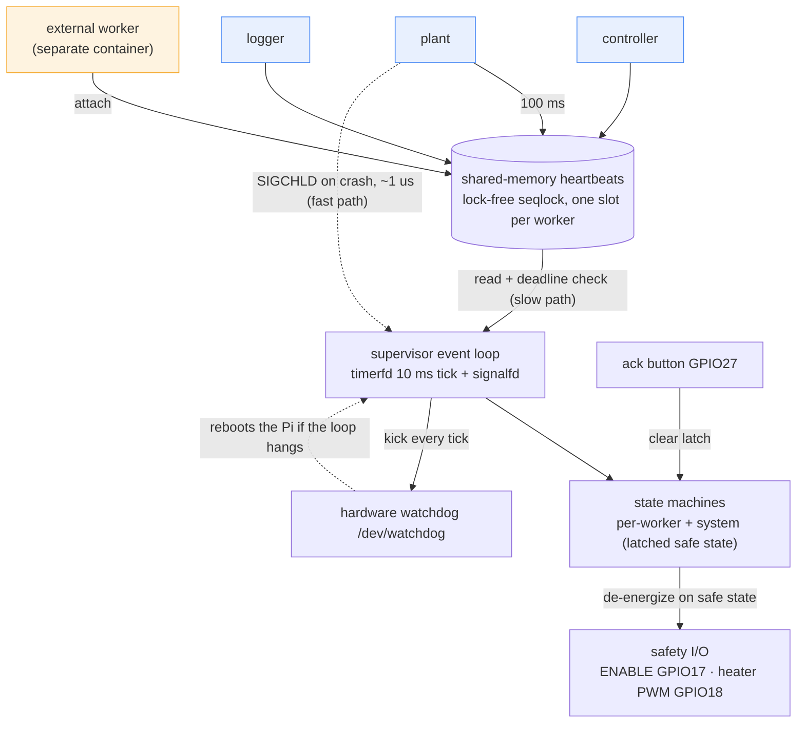
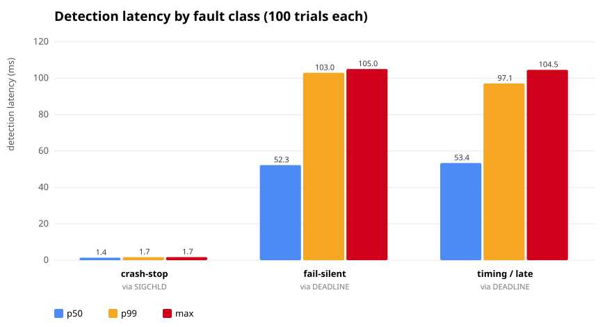
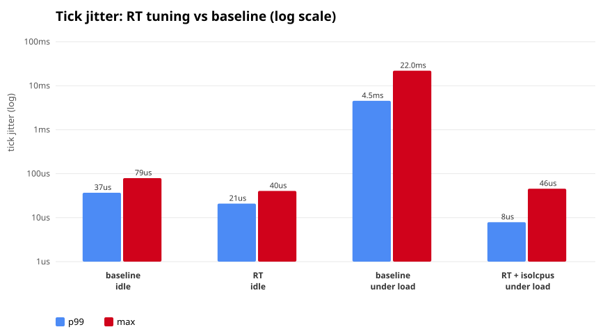

# Failsafe Supervisor


A C++ daemon for a Linux edge device (Raspberry Pi 3 B+) that supervises worker
processes over shared-memory heartbeats, detects missed deadlines against a
monotonic clock, restarts them under a budgeted policy, and, when a worker
cannot be recovered, drives the system into a defined **safe state**.

Goal: inject faults systematically and measure recovery latency per fault class.

## How it works



The system models a single-zone thermal controller (the "heater" is a PWM-dimmed
LED). The load-bearing idea is that the physical process does not stop when the
software does, so a component must detect that control is untrustworthy within a
bounded time and drive the outputs to a state that is safe by definition.

1. **Heartbeats (data plane).** Each worker writes a heartbeat -- a 64-bit
   sequence counter and a `CLOCK_MONOTONIC` timestamp -- into its slot in a
   shared-memory region every 100 ms. The slot is a **lock-free seqlock**: no
   mutex, deliberately, because a worker `SIGKILL`ed mid-write must never leave a
   lock held. One writer, one reader per slot.

2. **Two detection paths.** The supervisor wakes on a 10 ms `timerfd` tick,
   reads each slot, and compares its age against the deadline. A worker that is
   *alive but silent* (hung, `SIGSTOP`, or a remote container that stopped) is
   caught only this way -- in `deadline + tick`. A worker the supervisor
   *spawned* that crashes is caught far faster: the kernel delivers `SIGCHLD`
   (folded into the loop via `signalfd`) in microseconds. Same event, two paths,
   a ~38x latency gap that the [measurements](#results) quantify.

3. **Restart policy.** On failure an owned worker is restarted with exponential
   backoff, up to a budget within a sliding window. When the budget is spent it
   gives up and the system escalates. An **external** worker cannot be restarted
   (the supervisor did not spawn it), so its failure escalates immediately --
   strictly weaker, which is the point of the [container demo](#containers-spawn-vs-attach).

4. **Two state machines.** A per-worker machine
   (`Starting → Alive → Failed → Restarting → GaveUp`) and a system machine
   (`Init → Running → Degraded → SafeState`). Every transition is logged with a
   monotonic timestamp -- that log is the measurement record.

5. **Latched safe state.** When a worker cannot be recovered the system
   de-energizes: heater PWM to 0, `ENABLE` line low, and it **latches** there
   until a human presses the physical ack button. The actuator is owned solely by
   the supervisor (single point of actuation): a failed worker can never move the
   output, only cause the supervisor to command a state. Safe state is the
   *passive* state -- on any reset every GPIO reverts to input, so `ENABLE` falls
   with an external pull-down even if the code never runs.

6. **Who watches the watcher.** The supervisor kicks a hardware watchdog every
   tick. If the loop hangs, the kicks stop and the Pi reboots -- and a reset is
   itself the safe state. This is stronger than a second supervisor process,
   which would only move the question.


## Status
- [x] M0 — bring-up: toolchain, CMake, CI, first LED
- [x] M1 — heartbeat + deadline detection
- [x] M2 — restart policy + SIGCHLD fast path
- [x] M3 — state machines + latched safe state (logic, CI, and on-Pi LED/button verified)
- [x] M4 — hardware watchdog (BCM /dev/watchdog; SIGSTOP supervisor -> Pi reboots, verified)
- [x] M5 — fault injection + measurement (3 classes x100; CSV + chart)
- [x] M6 — containers (Docker Compose; spawn-vs-attach asymmetry)
- [x] M7 — real-time tuning (SCHED_FIFO + mlockall + isolcpus; ~570x lower tick jitter under load)

## Results

Each fault class is injected 100 times and the latency is measured in a single
clock domain: `t0` is `CLOCK_MONOTONIC` (`now_ns`) captured immediately before
injection, `t1` is the supervisor's structured `EV <mono_ns> ...` event. Because
every process on the Pi shares `CLOCK_MONOTONIC`, `latency = t1 - t0` is exact.
Reproduce with `scripts/measure.sh` + `scripts/analyze.py`.



| fault class | detection path | n | detect p50 | detect p99 | detect max | recover p50 | recover p99 |
|---|---|---:|---:|---:|---:|---:|---:|
| crash-stop (SIGKILL) | SIGCHLD | 100 | 1.36 | 1.70 | 1.70 | 216.9 | 221.0 |
| fail-silent (SIGSTOP) | deadline | 100 | 52.26 | 102.97 | 105.00 | 266.1 | 315.1 |
| timing / late (300 ms stall) | deadline | 100 | 53.39 | 97.07 | 104.54 | 268.8 | 316.7 |

*(all latencies in ms)*

**What the numbers say.** The two detection paths differ by ~38x in median
latency, and the difference is structural, not incidental:

- **SIGCHLD (crash-stop)** is phase-independent: the kernel signals the death
  immediately, so detection is ~1.4 ms with a tight spread (p99 1.70 ms).
- **Deadline (fail-silent, timing)** is phase-dependent: a fault arrives at a
  uniformly random point within the heartbeat period, so detection from
  injection spans `[0, deadline]`. The data matches the theory almost exactly --
  p50 ~= deadline/2 (52 ms) and p99 ~= deadline + tick (103 ms, with the 100 ms
  deadline and 10 ms tick). The worst case is `deadline + tick`, not `deadline`,
  because detection is quantised to the tick; this is stated so the numbers are
  honest rather than flattering.

Recovery includes the 200 ms restart backoff plus the new worker arming, which
is why it clusters around 217 ms (crash-stop) and 266 ms (deadline paths).


## Target hardware
Raspberry Pi 3 B+, Raspberry Pi OS (Debian 13 trixie, aarch64), GCC 14, libgpiod 2.

## Build
On the Pi (with hardware backend):
\`\`\`sh
cmake -S . -B build -G Ninja -DHAVE_GPIO=ON
cmake --build build
ctest --test-dir build --output-on-failure
\`\`\`
CI builds and tests off-target on x86_64 with \`HAVE_GPIO=OFF\`, so the code base
stays portable and the hardware layer sits behind a compile-time switch.

## Design notes
- **Clocks.** Deadline tracking uses \`CLOCK_MONOTONIC\`, never wall-clock time, so
  an NTP step or an operator changing the date cannot affect detection. The Pi
  has no RTC, so \`CLOCK_REALTIME\` jumps by decades once NTP syncs; \`sanity\`
  prints both clocks to make that gap visible.
- **Lock-free heartbeat.** The heartbeat record is two 64-bit atomics, which are
  natively lock-free on aarch64. \`sanity\` asserts this at run time; a 32-bit
  image would silently break the "lock-free" claim.


## Containers (spawn vs attach)

`docker compose up` runs two containers:

- **supervisor** -- owns `plant`/`controller`/`logger` (spawned via fork/exec)
  and creates the shared-memory region; it also monitors one *external* worker.
- **external-worker** -- a separate container that attaches to the region over a
  shared `/dev/shm` (`ipc: "service:supervisor"`) and publishes into slot 3.

The point is the **asymmetry**, which the supervisor makes explicit:

| | owned worker | external worker |
|---|---|---|
| spawned by supervisor | yes (fork/exec) | no (attaches) |
| crash detection | SIGCHLD (~1 ms) | none |
| silent detection | deadline | deadline (more lenient) |
| on failure | restart, then escalate | escalate immediately |

Stopping the external worker's container is detected only via its deadline and
escalates straight to safe state, because the supervisor cannot restart a
process it did not spawn:

```
docker compose stop external-worker
# supervisor: EV ... DETECT_DEADLINE external0 (age~504ms)
#             external worker external0 cannot be restarted -> ESCALATE
#             [SYSTEM] Running -> SafeState
```

Containers isolate exactly the things a supervisor needs to see across (process
lifecycle, signals, memory); sharing `/dev/shm` and giving external workers a
more lenient deadline is the cost of that isolation. The asymmetry is covered by
`m6_smoke` in CI without Docker. The container image builds off-target
(`HAVE_GPIO=OFF`, `LogSafetyIo`); GPIO and the watchdog are host-only.


## Real-time tuning (tick jitter)

The supervisor's guarantees rest on its 10 ms tick firing on time. Under CPU
contention a stock scheduler can delay it badly, so the tick's own jitter is
measured (deviation of each wakeup interval from the nominal period, warmup
excluded) with and without `SCHED_FIFO` + `mlockall` + CPU pinning, and with the
pinned core isolated via `isolcpus=3`. Reproduce with `scripts/jitter.sh`.



| configuration | p50 | p99 | p99.9 | max |
|---|---:|---:|---:|---:|
| baseline, idle | 1.1 us | 36.8 us | 53.9 us | 79 us |
| RT, idle | 3.2 us | 20.9 us | 26.2 us | 41 us |
| **baseline, under load** | 0.5 us | **4528 us** | 6532 us | **21987 us** |
| **RT + isolcpus, under load** | 1.1 us | **7.9 us** | 15.0 us | **46 us** |

*(load = four busy loops saturating all cores; RT run as root, pinned to the
isolated CPU 3)*

**The point is the load row.** With a stock scheduler under load the 10 ms tick
is delayed by **4.5 ms at p99 and up to 22 ms worst case** -- enough to blow the
100 ms detection deadline several times over. `SCHED_FIFO` + `mlockall` +
pinning to an `isolcpus`-isolated core keeps p99 at **7.9 us** and the worst case
at **46 us**, a ~570x improvement at p99. Idle, the difference is minor; the
tuning earns its keep exactly when the box is busy, which is when a failsafe
supervisor most needs to stay deterministic.

Enable at runtime with `FAILSAFE_RT=1 FAILSAFE_CPU=3` (needs root); isolate the
core by appending `isolcpus=3` to `/boot/firmware/cmdline.txt` and rebooting. A
single ~5 ms startup transient (worker spawns) is excluded as warmup; a stock
kernel still admits rare hardware-interrupt spikes that a PREEMPT_RT kernel and
IRQ affinity would address further -- noted rather than hidden.

## Out of scope (deliberate)
Two-node failover is out of scope: with two nodes you cannot form a quorum, so a
network partition yields split-brain -- two supervisors each asserting ownership
of the actuator, which is worse than the fault it was meant to prevent. Doing it
correctly requires a third node or external arbitration plus fencing; noted as
future work rather than half-implemented here.

## Hardware watchdog (who watches the watcher)

The supervisor kicks the BCM2835 hardware watchdog (`/dev/watchdog0`) every tick
while its event loop is alive. If the supervisor hangs or dies, the kicks stop
and the board reboots after ~15 s; a reset drives every GPIO back to input, so
ENABLE falls and the heater goes off -- a dead supervisor still converges on the
safe state. This is the answer to "who supervises the supervisor," and it is
much stronger than a second supervisor process (which just moves the question).

- Raspberry Pi OS gives systemd the hardware watchdog by default
  (`RuntimeWatchdogSec=1m`). `scripts/setup-pi.sh` overrides that to 0 so the
  supervisor can own the device directly; run the supervisor as root.
- Clean shutdown writes the magic character `V` before closing, disarming the
  watchdog so stopping the supervisor normally never reboots the box.
- Kicked in every state including SafeState: the watchdog guards supervisor
  *liveness*, which is a separate concern from plant safety. A latched SafeState
  is a handled state, not a hang.
- Verified on hardware: `SIGSTOP` the supervisor and the Pi reboots ~15 s later
  (boot id changes, uptime resets).
- Alternative on a systemd host: run as a service with `WatchdogSec` +
  `sd_notify(WATCHDOG=1)`, layering app -> systemd -> hardware. Chosen the direct
  route so the reboot is attributable to our own code and mirrors an MCU IWDG.
